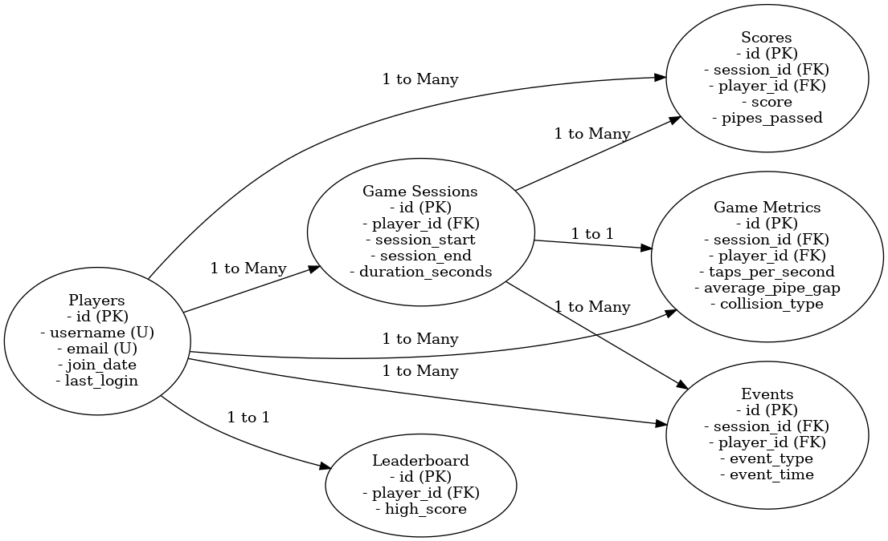

# **Design Document**

**By Eren Kadir Bagci**
**Video Overview**: <[\[URL HERE\]](https://youtu.be/jyrkXU2qnN8)>

---

## **Scope**

The main purpose of my database is to keep track of all the data related to a Flappy Bird-style game. This includes things like player information, game sessions, scores, gameplay metrics, and in-game events. I want it to help store and analyze this data efficiently while also enabling players to track their progress, compare scores, and see where they rank.

In the database, I’ve included data about:
- Players: their usernames, emails, and activity.
- Game sessions: start and end times, duration, etc.
- Scores: how well players did in a session.
- Leaderboards: showing top-performing players.
- Gameplay metrics: detailed performance data like taps per second and collision points.
- Events: things like power-ups, pauses, or collisions during the game.

What’s **outside the scope** is anything not directly related to gameplay. For example, I didn’t include things like in-app purchases, chat features, or multiplayer interactions. This database is focused purely on storing and analyzing game-related data.

---

## **Functional Requirements**

### What Users Can Do:
- Players can track their game sessions and scores.
- They can view leaderboard rankings to compare themselves with others.
- Developers or analysts can look at gameplay metrics like taps per second or the type of collisions players are experiencing.
- Events during the game, like power-ups or pauses, can also be reviewed.

### What Users Can’t Do:
- Players can’t access or modify data belonging to other players.
- There are no advanced analytics or prediction features built-in (e.g., predicting future scores).
- This database doesn’t support multiplayer gameplay data or monetization tracking.

---

## **Representation**

### **Entities**

Here’s a breakdown of what I’ve included in the database:

- **Players**: This table stores the basic details for each player like their username, email, when they joined, and their last login. I chose `TEXT` for unique fields like username and email and added constraints to prevent duplicates.
- **Game Sessions**: This tracks every time a player starts and ends a session. Start and end times are stored as `TIMESTAMP`, and I calculate session duration using a view.
- **Scores**: This table stores scores achieved during each session along with the number of pipes passed.
- **Leaderboards**: High scores are stored here with rankings.
- **Game Metrics**: This includes detailed gameplay data like taps per second, average pipe gap, and collision types. The `collision_type` field uses a `CHECK` constraint to limit the values to valid options.
- **Events**: This table logs things like collisions, pauses, and power-ups during the game.

### **Relationships**

The relationships between these entities are straightforward:
- Each player can have multiple game sessions, but a session belongs to one player.
- Each session can have multiple scores and events, but scores and events are tied to one session.
- The leaderboard links each player to their top score.

Here’s an entity relationship diagram (ERD) to help visualize it:

---

## **Optimizations**

To make the database more efficient, I’ve added a few optimizations:

- **Indexes**:
  - I added an index on `players.username` to make it faster to look up players by their usernames.
  - There’s also an index on `game_sessions.player_id` for quickly finding all sessions for a player.
  - Events have an index on `event_type` so we can quickly query specific event types.

- **Views**:
  - I created a view called `game_sessions_with_duration` that calculates session durations dynamically. This keeps the schema clean while allowing for quick queries on session length.
  - The `top_scores` view simplifies fetching the highest score for each player.
  - The `player_statistics` view combines player details with total sessions and their highest scores, making reporting easier.

---

## **Limitations**

While this database serves its purpose well, it does have some limitations:
1. It doesn’t support advanced features like tracking in-app purchases or multiplayer gameplay interactions.
2. Historical changes to the leaderboard aren’t recorded. It only stores the current high score for each player.
3. The database doesn’t include predictive analytics or advanced insights—these would need to be built on top of the stored data.

Overall, this database is designed to handle the core gameplay features of a Flappy Bird-style game while keeping the schema simple and efficient.
